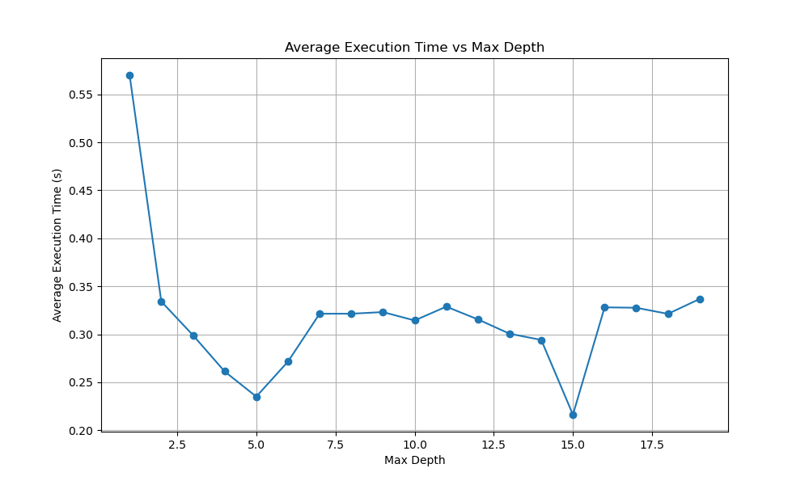
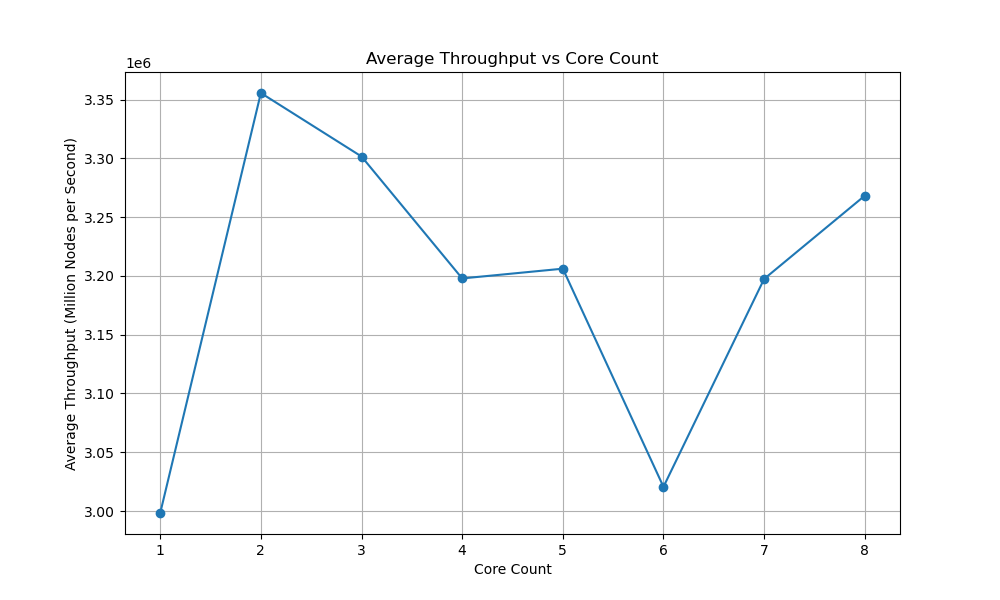
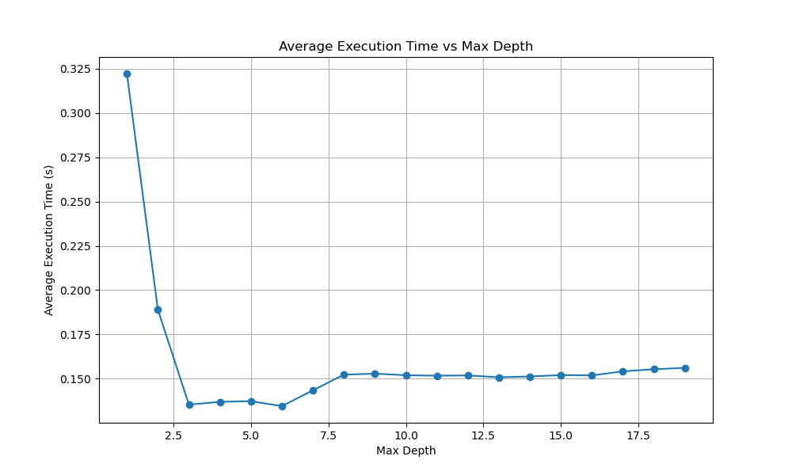
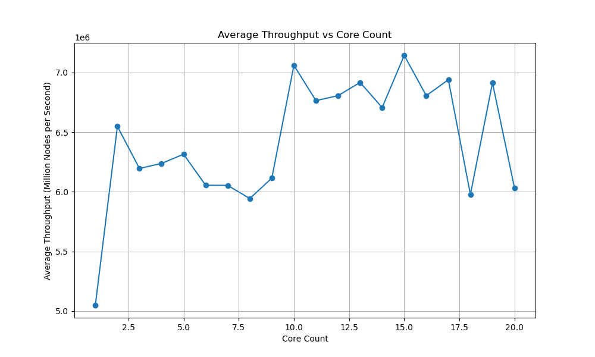

# Rapport

Auteur:
Dominique Elias (ELID14019800)

## Parallelisation

### Étape 1 - concurrent_vector

D'abord il faut rendre le vecteur `nodes_` `tbb::concurrent_vector` pour permettre l'ajout de noeuds en parallèle.

```cpp
// vpparallel.h
tbb::concurrent_vector<VPNode> nodes_;
```

### Étape 2 - makeNode atomique

Ensuite, il faut rendre la fonction `makeNode(int item)` atomique, car elle retourne l'index essentiel pour la construction, pour faire cela on n'utilise plus `.size()` qui peut ne pas donner le resultat attendu en parallèle, on utilise donc l'itérateur retourner par `push_back` pour obtenir l'index du noeud ajouté, ce qui rend cette fonction atomique.

```cpp
int VPTreeParallel::makeNode(int item) {
  auto it = nodes_.push_back(VPNode(item));
  return static_cast<int>(std::distance(nodes_.begin(), it));
}
```

### Étape 3 - tbb::task_group

On peut maintenant paralléliser la fonction `build` en utilisant `tbb::task_group` pour ajouter les noeuds en parallèle.
```cpp
tbb::task_group g;
g.run([&] {
    n.left = makeTree(lower + 1, median);
});
g.run([&] {
    n.right = makeTree(median, upper);
});
g.wait();
```

### Étape 4 - granularité

Pour finir, on doit controler la granularité de la parallélisation, pour cela on utilise une variable `max_depth` qui limite la profondeur de l'arbre pour la parallélisation.

```cpp
// vpparallel.h
void setMaxDepth(int max_depth);
int m_max_depth = std::numeric_limits<int>::max(); // default
```

et on modifie la fonction `makeTree` pour prendre en compte cette limite.

```cpp
// vpparallel.cpp
if (depth < max_depth) {
    tbb::task_group g;
    g.run([&] {
       n.left = makeTree(lower + 1, median, depth + 1, max_depth);
    });
    g.run([&] {
        n.right = makeTree(median, upper, depth + 1, max_depth);
    });
    g.wait();
} else {
    n.left = makeTree(lower + 1, median, depth + 1, max_depth);
    n.right = makeTree(median, upper, depth + 1, max_depth);
}
```

## Vérification

Avec les tests fournis, on peut vérifier que la parallélisation fonctionne correctement, il suffit d'augmenter le nombre de noeuds pour vérifier aucun problème de concurrence. l'outil `helgrind` nous a permis aussi de voir les `race conditions` et de les corriger.

par exemple, on peut tester avec 100000 noeuds, si on parallélise avec task_group, sans faire les les etapes 1 et 2, on obtient l'erreur de la fonction `build` qui n'est pas thread-safe.

```sh
$ valgrind --tool=helgrind ./build-release/bin/vantagepoint -n 1000 -p 1

==48704== Thread #4 was created
==48704==    at 0x4CA6A23: clone (clone.S:76)
==48704==    by 0x4CA6BA2: __clone_internal_fallback (clone-internal.c:64)
==48704==    by 0x4CA6BA2: __clone_internal (clone-internal.c:109)
==48704==    by 0x4C1953F: create_thread (pthread_create.c:297)
==48704==    by 0x4C1A194: pthread_create@@GLIBC_2.34 (pthread_create.c:836)
==48704==    by 0x4854975: ??? (in /usr/libexec/valgrind/vgpreload_helgrind-amd64-linux.so)
==48704==    by 0x489CBEC: ??? (in /usr/lib/x86_64-linux-gnu/libtbb.so.12.11)
==48704==    by 0x48A2C84: ??? (in /usr/lib/x86_64-linux-gnu/libtbb.so.12.11)
==48704==    by 0x489B5AC: ??? (in /usr/lib/x86_64-linux-gnu/libtbb.so.12.11)
==48704==    by 0x489EA7F: ??? (in /usr/lib/x86_64-linux-gnu/libtbb.so.12.11)
==48704==    by 0x1136B0: VPTreeParallel::makeTree(int, int, int, int) (in /home/razer/Documents/INF5171/tp2/inf5171-243-tp2-v2/build-release/bin/vantagepoint)
==48704==    by 0x113E4D: VPTreeParallel::build() (in /home/razer/Documents/INF5171/tp2/inf5171-243-tp2-v2/build-release/bin/vantagepoint)
==48704==    by 0x10C0F6: main (in /home/razer/Documents/INF5171/tp2/inf5171-243-tp2-v2/build-release/bin/vantagepoint)

```

En revanche, si on fait les étapes 1 et 2, on n'obitent plus d'erreur de concurrence dans la fonction `build`.

## Graphique

### Benchmarks sur la grappe





### Benchmarks sur mon ordinateur





## Analyse Graphe

J'ai effectué plusieurs benchmarks sur la grappe, mais les graphiques obtenus contiennent un peu de "bruit". Les versions des benchmarks réalisées sur un ordinateur donnent une idée plus claire de l'analyse.

### Debit par nombre de coeur

Bien que le graphe présente des fluctuations, on observe que le débit reste relativement stable autour de la moyenne. Par exemple, dans le cas de la grappe, le débit se situe toujours autour de 3,15 M avec une variation de ±0,15 M en fonction du nombre de cœurs. Le même phénomène se remarque sur le graphique de  l'ordinateur, où le débit moyen est d'environ 6 M, avec une variation de ±1 M.

Un débit stable est un indicateur d’une bonne parallélisation.

### Temps par granularite

On observe ici une réduction agressive du temps d'exécution dès que l'on "ouvre" le parallélisme en augmentant le `max_depth`, mais cette réduction atteint un plafond à partir d’une certaine profondeur. Au-delà de cette valeur, le temps commence même à augmenter avec une granularité très fine, car le surcoût de gestion des tâches devient significatif. Cette tendance est visible dans les deux graphiques.

## Commande utilisées

### Compilation

```sh
./build/Desktop-Release/bin/bench_vptree 
cmake -G Ninja -S . -B build-release -DCMAKE_BUILD_TYPE=Release
cmake --build build-release
```

### Grappe

```sh
srun -c 8 ./build-release/bin/bench_vptree 
scp username@inf5171.calculquebec.cloud:weak_scale.dat .
```

### Helgrind

```sh
valgrind --tool=helgrind ./build-release/bin/vantagepoint -n 1000 -p 1
```

### Graphique

```sh
pip install pandas
pip install matplotlib
python3 plot.py
```

### Nettoyage

ce nettyoage n'est pas requis, car le script python utilise la moyenne des lignes dupliquées dans les fichier `.dat` pour les graphiques.

```sh
awk '!seen[$1]++' granularite.dat > granularite.dat
```